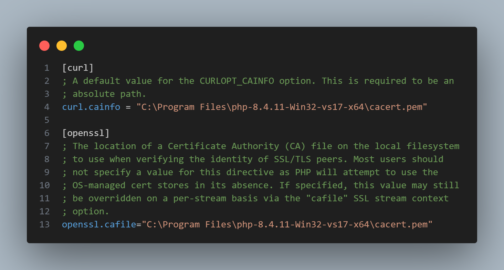

# 🔔 Repository-NotifyPush

<div align="center">


**Sistema avanzado de notificaciones push que funciona tanto en primer plano como en segundo plano**

[🚀 Instalación](#-instalación) • [⚙️ Configuración](#️-configuración) • [📖 Documentación](#-documentación) • [🤝 Contribuir](#-contribuir)

</div>

---

## 📋 Tabla de Contenidos

- [✨ Características](#-características)
- [🔧 Prerequisitos](#-prerequisitos)
- [🚀 Instalación](#-instalación)
- [⚙️ Configuración](#️-configuración)
- [🔑 Generación de VAPID Keys](#-generación-de-vapid-keys)
- [📱 Uso](#-uso)
- [🛠️ Solución de Problemas](#️-solución-de-problemas)
- [🤝 Contribuir](#-contribuir)
- [📄 Licencia](#-licencia)

---

## ✨ Características

- 🌟 **Notificaciones en tiempo real** - Funciona en primer y segundo plano
- 🔒 **Seguridad avanzada** - Implementación completa del protocolo Web Push
- 🎯 **Cross-platform** - Compatible con todos los navegadores modernos
- ⚡ **Alto rendimiento** - Optimizado para aplicaciones de gran escala
- 🔧 **Fácil configuración** - Setup automatizado con scripts incluidos

---

## 🔧 Prerequisitos

Antes de comenzar, asegúrate de tener instalado:

| Requisito | Versión | Descripción |
|-----------|---------|-------------|
| PHP | >= 7.4 | Lenguaje de programación |
| OpenSSL | >= 1.1.1 | Para generación de claves VAPID |
| Composer | Latest | Gestor de dependencias |

---

## 🚀 Instalación

### 1️⃣ Clonar el repositorio

```bash
git clone https://github.com/tu-usuario/Repository-NotifyPush.git
cd Repository-NotifyPush
```

### 2️⃣ Instalar dependencias

```bash
composer install
```

### 3️⃣ Configurar permisos

```bash
chmod +x generateKeys.php
```

---

## ⚙️ Configuración

### 🔐 Instalación de OpenSSL

> **⚠️ Importante:** OpenSSL es fundamental para la generación de claves VAPID

#### Para Windows:

1. **Descargar OpenSSL:**
   - Visita: [https://slproweb.com/products/Win32OpenSSL.html](https://slproweb.com/products/Win32OpenSSL.html)
   - Descarga la versión recomendada para tu sistema

2. **Configurar variables de entorno:**
   ```
   Variable: OPENSSL_CONF
   Valor: C:\OpenSSL-Win64\bin\openssl.cfg
   ```
   
   <div align="center">
   
   </div>

3. **Verificar instalación:**
   ```bash
   openssl version
   ```
   
   ✅ **Salida esperada:** `OpenSSL 1.1.1x`

### 📜 Configuración de certificados SSL

1. **Descargar cacert.pem:**
   ```bash
   curl -o cacert.pem https://curl.se/ca/cacert.pem
   ```

2. **Ubicar archivo:**
   - Coloca `cacert.pem` en una carpeta segura
   - Recomendado: Misma carpeta de instalación de PHP

3. **Configurar php.ini:**
   
   Localiza y actualiza las siguientes líneas:
   ```ini
   ; Configuración SSL/TLS
   curl.cainfo = "C:\path\to\cacert.pem"
   openssl.cafile = "C:\path\to\cacert.pem"
   ```
   
   <div align="center">
   
   </div>

---

## 🔑 Generación de VAPID Keys

Una vez completada la configuración, genera tus claves VAPID:

```bash
php generateKeys.php
```

### 🎉 ¡Salida exitosa!

```
🔑 VAPID Keys generadas exitosamente:

📋 Public Key:  BEl62iUYgUivxIkv69yViEuiBIa6Ixi...
🔐 Private Key: aUWqagazNjr0BqXaS3Y2EmSKDs...

✅ Las claves han sido guardadas en: /config/vapid-keys.json
```

---

## 📱 Uso

### 🔧 Configuración básica

```php
<?php
require_once 'vendor/autoload.php';

use NotifyPush\WebPush;
use NotifyPush\VapidKeys;

// Cargar claves VAPID
$keys = VapidKeys::load();

// Configurar cliente Web Push
$webPush = new WebPush([
    'VAPID' => [
        'subject' => 'mailto:tu-email@ejemplo.com',
        'publicKey' => $keys->getPublicKey(),
        'privateKey' => $keys->getPrivateKey()
    ]
]);
```

### 📤 Enviar notificación

```php
// Enviar notificación push
$notification = [
    'title' => '🎉 ¡Nueva notificación!',
    'body' => 'Este es el contenido de tu notificación',
    'icon' => '/assets/icon.png',
    'badge' => '/assets/badge.png'
];

$result = $webPush->sendOneNotification(
    $subscription,
    json_encode($notification)
);
```

---

## 🛠️ Solución de Problemas

<details>
<summary><strong>❌ Error: "openssl no reconocido como comando"</strong></summary>

**Causa:** OpenSSL no está instalado o no está en el PATH del sistema.

**Solución:**
1. Reinstalar OpenSSL siguiendo la [guía de instalación](#-instalación-de-openssl)
2. Verificar variables de entorno
3. Reiniciar terminal/símbolo del sistema

</details>

<details>
<summary><strong>❌ Error: "SSL certificate problem"</strong></summary>

**Causa:** Certificados SSL no configurados correctamente.

**Solución:**
1. Descargar `cacert.pem` actualizado
2. Verificar rutas en `php.ini`
3. Reiniciar servidor web

</details>

<details>
<summary><strong>❌ Error: "VAPID keys generation failed"</strong></summary>

**Causa:** Problemas con la configuración de OpenSSL.

**Solución:**
1. Verificar `openssl version`
2. Comprobar permisos de escritura
3. Ejecutar como administrador si es necesario

</details>

---

## 📊 Estado del Proyecto

| Característica | Estado | Versión |
|----------------|--------|---------|
| Notificaciones Web Push | ✅ Completo | 2.1.0 |
| Soporte multinavegador | ✅ Completo | 2.1.0 |
| Documentación | ✅ Completo | 2.1.0 |
| Testing automatizado | 🔄 En desarrollo | 2.2.0 |
| Dashboard admin | 🔄 En desarrollo | 2.2.0 |

---
### 🚀 Proceso de contribución

1. Fork el proyecto
2. Crea tu feature branch (`git checkout -b feature/AmazingFeature`)
3. Commit tus cambios (`git commit -m 'Add some AmazingFeature'`)
4. Push al branch (`git push origin feature/AmazingFeature`)
5. Abre un Pull Request

---

## 📄 Licencia

Este proyecto está bajo la Licencia MIT - ver el archivo [LICENSE.md](LICENSE.md) para más detalles.

---

<div align="center">

**⭐ Si este proyecto te ha sido útil, ¡danos una estrella!**


---

Hecho con ❤️ por [Tu Nombre](https://github.com/tu-usuario)

</div>